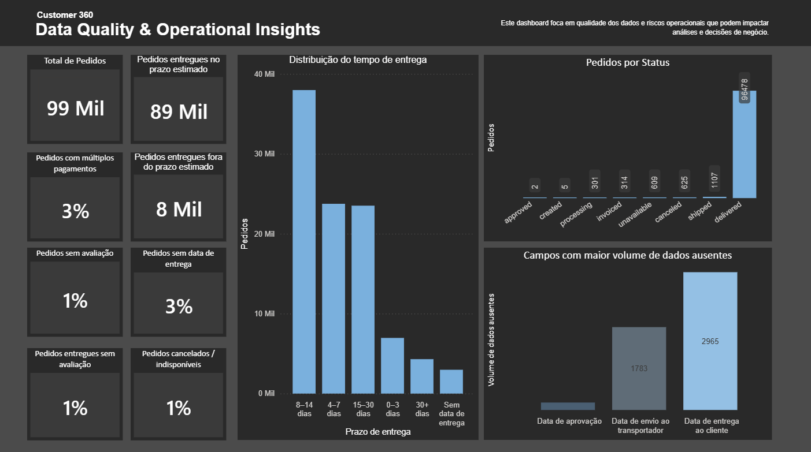
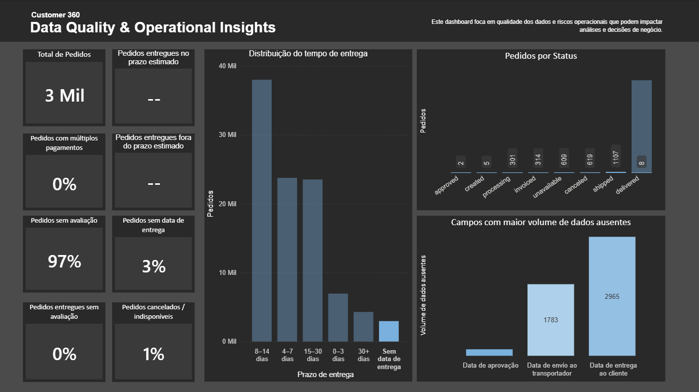
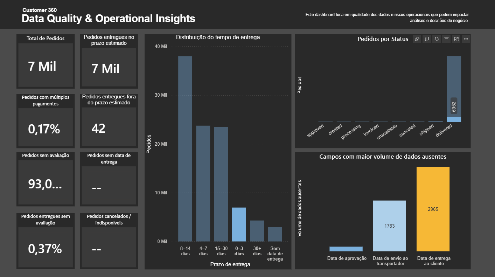
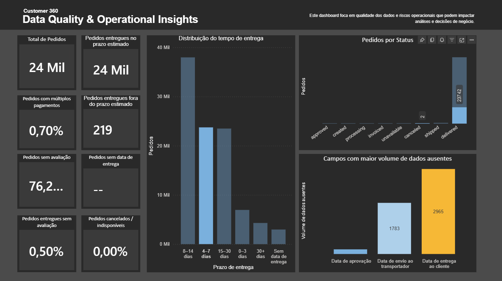
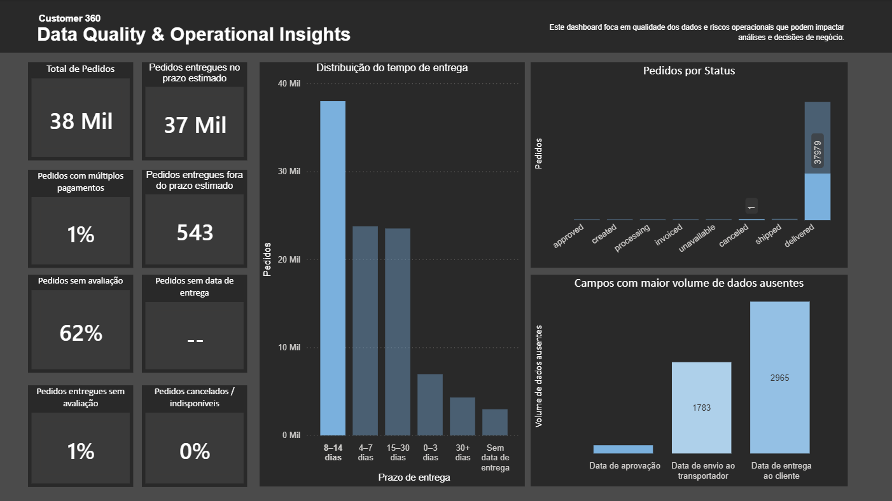
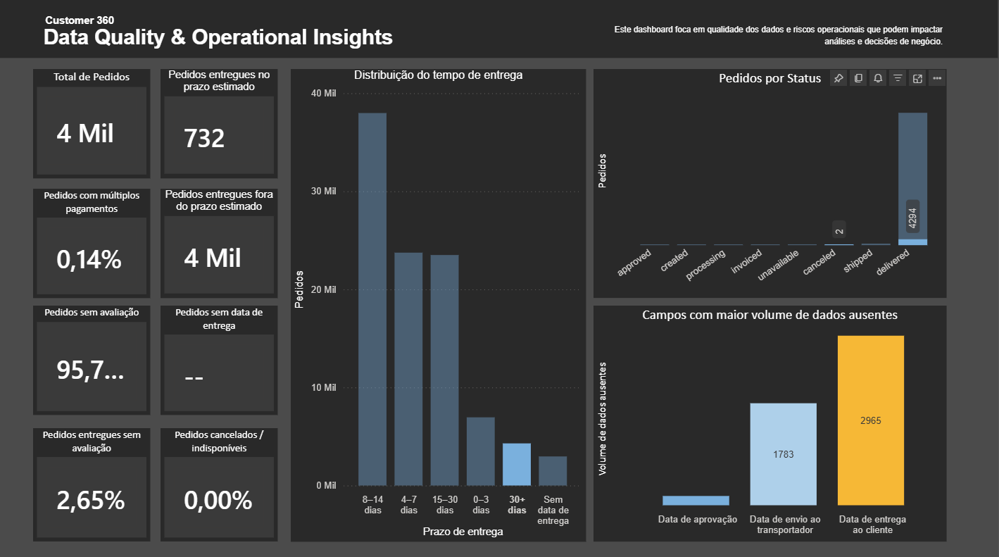

# 📊 Customer 360 — Data Quality & Operational Insights

## 📌 Visão Geral
Este projeto apresenta uma análise focada em qualidade dos dados e riscos operacionais em um cenário de E-commerce.  
O objetivo não é avaliar performance comercial, mas sim identificar falhas de dados, inconsistências operacionais e riscos analíticos que podem impactar análises e decisões de negócio.

---

## 🧩 Contexto do Projeto
Em ambientes analíticos, decisões são tomadas com base em métricas como tempo de entrega, status de pedidos e avaliações de clientes.  
No entanto, dados incompletos ou inconsistentes podem distorcer essas métricas, gerando análises imprecisas.

Utilizando a base pública da Olist, este projeto simula um cenário real de análise, focando em como problemas de qualidade dos dados se manifestam ao longo do ciclo do pedido.

---

## 🎯 Objetivo do Projeto
- Avaliar a qualidade dos dados operacionais do E-commerce
- Identificar campos críticos com dados ausentes
- Analisar consistência entre status do pedido e eventos do processo
- Detectar riscos analíticos relacionados a prazos de entrega
- Demonstrar uma abordagem estruturada de Data Quality aplicada a Analytics

---

## 📈 Principais Análises e Indicadores
- Total de pedidos
- Pedidos entregues no prazo estimado
- Pedidos entregues fora do prazo estimado
- Pedidos sem avaliação
- Pedidos entregues sem avaliação
- Pedidos sem data de entrega
- Pedidos com múltiplos pagamentos
- Pedidos cancelados ou indisponíveis
- Distribuição do tempo de entrega (identificação de outliers)
- Campos com maior volume de dados ausentes
- Distribuição de pedidos por status operacional

---

## 🎯 Conclusão
A análise evidencia que, mesmo com dados aparentemente completos, existem lacunas e inconsistências que podem comprometer análises de SLA, experiência do cliente e eficiência operacional.

**O projeto reforça a importância de tratar qualidade de dados como parte essencial do processo analítico, indo além da criação de métricas e dashboards tradicionais.**

---

## 🧩 Estrutura do Dashboard
O dashboard foi organizado em blocos com papéis bem definidos:

- **KPIs de Data Quality & Operação:** visão geral da saúde dos dados
- **Completude dos Dados:** identificação de campos críticos com valores ausentes
- **Consistência Operacional:** análise do fluxo e status dos pedidos
- **Riscos Analíticos:** identificação de outliers e desvios operacionais relevantes

Essa estrutura permite uma leitura clara, progressiva e orientada à tomada de decisão.

---

## 🛠️ Ferramentas Utilizadas
- Python (Pandas): limpeza, tratamento e preparação dos dados
- Power BI: modelagem, DAX e visualização
- Git & GitHub: versionamento e documentação do projeto

---

## 📚 Principais Aprendizados
- Qualidade de dados impacta diretamente a confiabilidade das análises
- Campos ausentes em etapas críticas geram riscos analíticos relevantes
- Outliers operacionais podem distorcer métricas de desempenho
- Padronização e tratamento de valores são essenciais para leitura executiva
- Dashboards eficazes priorizam clareza, propósito e contexto, não apenas visual

---

## 📷 Preview do Dashboard

**📊 Dashboard completo**

**🚚 Sem data de entrega**

**🚚 Entrega de 0-3 dias**

**🚚 Entrega de 4-7 dias**

**🚚 Entrega de 8-14 dias**

**🚚 Entregas com mais de 30 dias**

🔗 [Abrir Dashboard no Power BI] https://acadcruzeirodosul-my.sharepoint.com/my?id=%2Fpersonal%2Fpaola%5Fbonfim%5Fcs%5Fcruzeirodosul%5Fedu%5Fbr%2FDocuments%2Fdash1%2Dcustomer360%2Epbix&parent=%2Fpersonal%2Fpaola%5Fbonfim%5Fcs%5Fcruzeirodosul%5Fedu%5Fbr%2FDocuments&ga=1

---
## 📫 Contato

**Paola Lopes**

🔗 LinkedIn: https://www.linkedin.com/in/paolalopes/

💻 GitHub: https://github.com/paollalopes

📧 Email: palopes06@hotmail.com

---
⭐ Se você chegou até aqui, fique à vontade para explorar os projetos e acompanhar minha evolução 🚀

